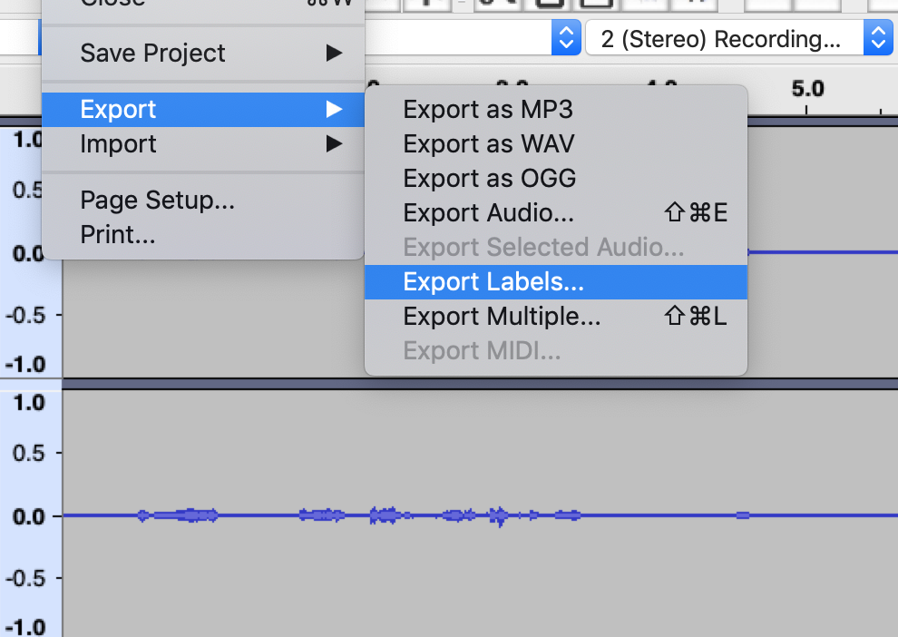

Slice any audio file by Audacity labels:
audacity_label_slicer_cli.py data/Reference.wav data/ReferenceLables.txt data/output --slice_size 2

Search and slice all disfluency audio files by Audacity labels (only with *Labels.txt filenames):
disfluency_search_label_slicer_cli.py ./ data/output --slice_size 2

Audacity label reader:

label_reader = alr.AudacityLabelReader(txt_label_file_path=self.txt_label_file_path,
                                            audio_file_path=self.audio_file_path)
Read all labels in seconds:                                            
labels = self.label_reader.get_labels_seconds(limit_to_audio_length=True)

Read all labels in samples:                                            
labels = self.label_reader.get_labels_seconds(limit_to_audio_length=True)

Make an Audacity project and add some lables Command + B:

Export lables .txt file with *Lables.txt suffix:

Export audio .wav file file same name without 'Lables' suffix:

Run audacity_label_slicer_cli.py or disfluency_search_label_slicer_cli.py to extract audio slices.

Have nice labeling!

